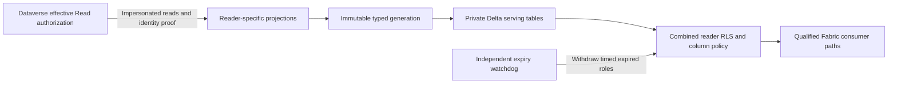

# Policy Weaver Dataverse read adapter

Policy Weaver publishes Dataverse-authorized reader projections into isolated Microsoft Fabric lakehouses. Dataverse evaluates cumulative Read privileges, Basic/Local/Deep/Global depth, business units, teams, ownership, POA sharing and field-security results. The adapter queries as each selected reader and preserves returned values, including NULL and masking. OneLake enforces short reader-and-generation predicates over those projections.

This repository contains the Python adapter, operator CLI, optional Dataverse identity-proof plug-in, native OneLake publisher, expiry watchdog, tests and an agent skill. **Client-specific production qualification is required.** Extraction, role dry runs and admin queries do not establish consumer enforcement or a revocation SLA.

Upgrading from the earlier `dvaccess 0.1.0` repository? Follow [the migration guide](docs/MIGRATING-FROM-DVACCESS.md). The new adapter uses a different configuration and serving model; old deployments are not changed by a Git update.

## Clone and invoke the skill

```text
git clone https://github.com/anlkorkut/policyweaver-dataverse.git
cd policyweaver-dataverse
```

Open your coding agent in the clone and use:

```text
$policyweaver-dataverse
Onboard this repository to my own Dataverse and Fabric environment.
Ask for the minimum missing information, discover IDs using my approved account,
create the client configuration and deployment plan, then guide me through
provisioning, publication and actual-reader acceptance tests.
```

The repository includes a [Codex-discoverable entrypoint](.agents/skills/policyweaver-dataverse/SKILL.md) and [the canonical skill](skills/policyweaver-dataverse/SKILL.md). No global skill installation is needed. For agents without repository-skill support, ask the agent to read the canonical file explicitly. Select the repository version if a personal skill has the same name. See [OpenAI's repository skill documentation](https://learn.chatgpt.com/docs/build-skills).

Start with your **Dataverse URL, tenant ID and expected operator UPN**. Discovery retrieves the organization ID, operator object ID, candidate readers, logical table/field metadata, Fabric workspaces and lakehouse/SQL endpoint details. You choose the workspace, readers, columns, identity-proof mode, retention and required access paths. The workflow does not select all users or adopt a source lakehouse automatically.

Follow the [client onboarding guide](docs/CLIENT-ONBOARDING.md) and [input/account reference](docs/CLIENT-INPUTS.md) for the complete procedure.

## Terminal setup

Use **64-bit Python 3.11** as the tested dependency baseline and Azure CLI. Later Python versions need qualification against the locked dependencies. Bootstrap uses the interpreter that launches it and creates a local virtual environment without changing Azure or global agent settings:

```text
python scripts/bootstrap_policyweaver.py --with-tests
```

On Windows, use the virtual-environment Python explicitly:

```powershell
.\.venv\Scripts\python.exe -m policyweaver.onboarding init --output-dir onboarding\client
```

On macOS/Linux, use `.venv/bin/python`. Fill `onboarding/client/request.json`, sign in interactively to the expected tenant with Azure CLI, then run:

```powershell
.\.venv\Scripts\python.exe -m policyweaver.onboarding discover --request onboarding\client\request.json --output onboarding\client\inventory.json
```

Templates intentionally contain null identifiers. Discovery refuses incomplete inputs, mismatched accounts/tenants and incomplete inventories. It uses GET requests for metadata; it does not read business records or change permissions. Discover table candidates first, attributes for chosen tables next, then rediscover the exact selected fields. Each inventory uses a new filename.

After choosing the exact workspace, readers and table/column lists in `selections.json`, create a **new private deployment directory**:

```powershell
.\.venv\Scripts\python.exe -m policyweaver.onboarding configure --request onboarding\client\request.json --inventory onboarding\client\inventory-selected.json --selections onboarding\client\selections.json --output-dir client-local\pilot
.\.venv\Scripts\python.exe -m policyweaver.onboarding validate --config client-local\pilot\policyweaver.config.json
```

The final inventory must match the request and selected workspace. Configuration generation is offline. It creates `policyweaver.config.json`, `deployment-plan.json`, input evidence and `NEXT-STEPS.md`. It does not provision or publish, and refuses existing output directories.

The operational sequence is `doctor` → authorized `provision` → portal/boundary setup → fresh `prepare` → `dry-run` → current boundary evidence → `publish` → actual-reader tests. Prepare after provisioning because new item IDs change the config hash. Keep the configuration, state and creation receipts to resume safely. Have an independent monitored watchdog ready before timed publication.

For live preparation logs:

```powershell
.\scripts\Run-PolicyWeaver.ps1 -Operation Prepare -Config client-local\pilot\policyweaver.config.json
```

See [terminal operation](docs/TERMINAL-AND-PRODUCTION.md). Direct CLI commands support `--progress` for sanitized JSON Lines on stderr and result JSON on stdout. Preparation writes sensitive per-reader data to the config-relative state directory; it grants no Fabric access.

## How access is represented



Each row carries `__pw_reader` and `__pw_generation`. A role per reader per shard filters those values and exposes selected business columns. POA and record-specific field sharing are demonstrated by comparing resulting rows and field values with Dataverse, rather than by one displayed Fabric rule per source grant. New-client role names contain the username, home BU and one prioritized role title, with action words removed: `pwtest001BNYWealthBNYMContactOwnerRole`. They label cumulative access rather than copy source roles one for one. See [naming and the version 0.3.1 controller upgrade](docs/READABLE-ROLES-AND-DIVERSITY.md); existing deployments require a new generation to change naming modes.

The source operator needs impersonation and sufficient table/field access. FetchXML proof requires the necessary reader `systemuser` access. Readers without it can use the optional [signed Dataverse `pw_ReadContext` plug-in](docs/READ-CONTEXT-PLUGIN.md), with an independently reviewed assembly SHA-256 and qualification of the installed function. Do not grant broad reader roles just to make identity proof succeed.

## Capacity and operational boundaries

- The planner accepts **up to 1,000 configured readers**. This is an input/sharding limit, not a production throughput guarantee. The default quota is 250 roles with 10 reserved, yielding 240 readers per audience shard. Table shards multiply the lakehouse count.
- Use a quota above 250 only with a target-specific Microsoft exception and live validation. Onboarding records the reference; it cannot independently verify it.
- Only explicitly selected supported scalar fields are projected. Unsupported complex, file, image and party-list fields fail closed. Lookups use Web API properties such as `_primarycontactid_value`.
- Refresh performs complete selected reader/table scans. It does **not** implement Dataverse security CDC or a generic delta feed. Measure extraction, publication and engine propagation with representative load before choosing a schedule or capacity SKU.
- Timed retention is the onboarding default. Manual retention persists until withdrawal/replacement but does not waive prepared-data freshness checks. Static OneLake roles do not expire themselves; API outages prevent the watchdog from guaranteeing a hard 60-minute revocation deadline.
- Fully unattended publication needs an external current boundary inspector for SQL mode, inherited access and alternate paths. This release consumes its assertion; it does not implement that inspector. Controlled publication and scheduled preparation are available.
- Consumers need base item Read and the intended native policies. Broad workspace, raw storage, item or delegated SQL permissions can bypass isolation. SQL User's identity mode, owner support, propagation, actual consumer sign-ins and revocations need separate checks on every enabled path.
- Discovery binds the expected account. Runtime Azure CLI credentials are tenant-bound; use an isolated CLI cache and recheck the active operator before operations. A plan's operator name is an observation, not a runtime account restriction.

## Documentation and verification

- [Client onboarding](docs/CLIENT-ONBOARDING.md) and [inputs/accounts/environment variables](docs/CLIENT-INPUTS.md)
- [Operator commands, deployment and recovery](docs/ADAPTER-OPERATIONS.md)
- [Security invariants and qualification gates](docs/ADAPTER-SECURITY.md)
- [Actual-reader acceptance and POA/POAA comparison](docs/LIVE-ACCEPTANCE.md)
- [Dataverse identity plug-in](docs/READ-CONTEXT-PLUGIN.md)
- [Readable native role names](docs/READABLE-ROLES-AND-DIVERSITY.md)
- [Retention behavior](docs/MANUAL-RETENTION.md)
- [Watchdog container and Azure deployment](deploy/README.md)

Run offline tests with the virtual-environment Python and `-m pytest -q`. Tests cover identity binding, source failures, projections, policy planning, lifecycle, publication, onboarding and release isolation. The C# plug-in has separate tests. Mocked inventories and offline tests do not replace client cloud qualification.

For a workspace containing private deployment data or research artifacts, export the reviewed product files before creating a source release:

```text
python scripts/build_release.py --output-directory dist/client-release --source-directory dist/client-source
```

The builder refuses existing targets and exports source manifests and hashes. Its allowlist excludes live configuration, state, inventories, reports, credential caches and demo-only scripts. Review the clean source before committing or pushing. Git ignore rules are a convenience, not a substitute for reviewing a Git diff.
