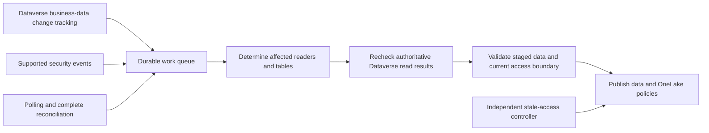

# Run Policy Weaver visibly and understand production operation

This guide describes the authoritative adapter in this repository. Start with [client onboarding](CLIENT-ONBOARDING.md) to create the client's own validated configuration. Live progress and log capture do not change authorization or expiry. Manual retention is a separate explicit setting that requires aligned publisher and watchdog configuration.

## Run from PowerShell

```powershell
# Run from the cloned repository root. Use the client's actual configuration.
$pwConfig = '.\clients\bank-pilot\deployment\policyweaver.config.json'
$pwPython = '.\.venv\Scripts\python.exe'

# Inspect the exact operation and selected tables without starting a run.
.\scripts\Run-PolicyWeaver.ps1 -Operation Prepare -Config $pwConfig -PythonPath $pwPython -Preview

# Validate the source organization, selected metadata and hydrated user count.
.\scripts\Run-PolicyWeaver.ps1 -Operation Doctor -Config $pwConfig -PythonPath $pwPython

# Fresh authoritative source reads and private local staging; no Fabric changes.
.\scripts\Run-PolicyWeaver.ps1 -Operation Prepare -Config $pwConfig -PythonPath $pwPython

# Historical local journal; this is not a live inventory of Fabric roles.
.\scripts\Run-PolicyWeaver.ps1 -Operation Status -Config $pwConfig -PythonPath $pwPython
```

Use an ordinary PowerShell terminal. If organizational execution policy blocks a script, use the direct Python command below or the bank's signed-script process; do not disable organizational controls. Existing Azure CLI authentication is reused. If sign-in expires, use interactive `az login --tenant YOUR_TENANT_ID` for the intended account; never put a password or token in a script.

Supply `-PythonPath` and `-Config` explicitly so the operation targets the intended virtual environment and client deployment. Paths with spaces are passed as arguments, not interpolated shell commands.

Direct Python equivalent:

```powershell
.\.venv\Scripts\python.exe -u -m policyweaver.adapter_cli `
  --config .\clients\bank-pilot\deployment\policyweaver.config.json --progress prepare
```

The PowerShell runner also writes four files below the configured state directory's `terminal-logs\<UTC>-<operation>-<unique-id>` folder:

- `terminal.log`: timestamped combined output, including process-alive messages during a quiet operation.
- `progress.jsonl`: the adapter's stderr stream, normally aggregate progress JSON Lines.
- `result.json`: the adapter's stdout result. An interrupted process may leave this incomplete or empty.
- `execution.json`: elapsed time, exit code and interruption status.

Progress reports source verification, metadata checks, reader/table ordinals, row counts, requests/retries and publication stages. It never includes business values, UPNs, reader IDs or tokens. Result JSON can include administrative configuration IDs and policy receipts. Restrict logs and the state directory to authorized operators. A process-alive message is not proof that source work advanced.

Ctrl+C interrupts the local process. During publication it can leave an uncertain or partial generation; inspect the journal and remote state before retrying. The launcher does not restore older roles or erase locks. Log/output failures must stop the local child rather than leave a hidden publisher running.

## Publishing is explicit

After resolving destination compatibility, preparing a fresh generation and genuinely inspecting its exact reader boundary, the same runner supports:

```powershell
# Replace GENERATION with the integer reported by Prepare.
.\scripts\Run-PolicyWeaver.ps1 -Operation DryRun -Generation GENERATION -Config $pwConfig -PythonPath $pwPython
.\scripts\Run-PolicyWeaver.ps1 -Operation BoundaryTemplate -Generation GENERATION -Config $pwConfig -PythonPath $pwPython
.\scripts\Run-PolicyWeaver.ps1 -Operation Publish -Generation GENERATION -Config $pwConfig -PythonPath $pwPython `
  -Boundary '.\clients\bank-pilot\deployment\boundary.json'
```

The boundary template is deliberately unverified. Its booleans and inspection time must come from actual inspections, never timestamp editing. It must cover exact readers, item access, workspace elevation, shortcuts, SQL mode and other access paths. An old static file cannot sustain unattended publication. Read `ADAPTER-OPERATIONS.md` for the required process.

Do not use `run`, `worker`, `withdraw` or `watchdog` just to view progress: those commands can invoke policy withdrawal. The launcher defaults to `prepare`; its explicit `Withdraw` operation removes this deployment's owned policies.

## Keep independently produced datasets separate

A synthetic fixture builder or another policy-mapping project is a different workload. Similar table names, role counts or field tiers do not prove that its rows are fresh Dataverse-authorized results. A globally readable security-reference table is not justified merely because it describes permissions. Static column removal by tier does not reproduce record-specific NULL or masking behavior.

Prepare can stage the client's source results without modifying such a dataset. Publishing into the same item requires a deliberate compatibility and ownership review; prefer a separate serving item. Deleting foreign roles alone does not fix schema differences or remove other bypasses. The watchdog reports unmanaged overlap and does not adopt or withdraw another application's policies.

## Sticky roles and freshness

Native OneLake role definitions persist until changed or removed. The adapter adds a separate freshness safeguard: generation-bearing predicates and a watchdog that withdraws stale owned roles in timed mode.

Stable role names are useful. The authoritative adapter already derives each role name from deployment and reader identity, so routine successful refreshes update the same names with a new generation. The roles need not disappear during healthy operation. Fabric may regenerate internal role IDs when a collection is updated, so applications must not rely on those IDs being permanent.

Keeping permissions after synchronization stops is an explicit retention choice. The default `"retention_mode": "timed"` keeps age-based watchdog withdrawal. Set `"retention_mode": "manual"` before a new preparation to waive age-based withdrawal for that deployment's configured serving items, and align every independent watchdog with that mode. No `expiry=0`, infinite timestamp or edited manifest is used: source preparation, publication reserve and boundary freshness remain finite and mandatory. The journal records a finite `publication_deadline_at` and `automatic_withdrawal_at: null` in manual mode. [Manual-retention instructions](MANUAL-RETENTION.md).

A terminated user's old access can remain in a manually retained snapshot until a fresh generation replaces it or the roles are withdrawn. Manual mode waives automatic age-based withdrawal for the explicitly selected scope; it does not satisfy a bank's 60-minute revocation requirement. Explicit `-Operation Withdraw`, policy replacement, and protective failure containment remain available. The watchdog still inspects role integrity; it is not globally disabled.

An alternative design could keep role objects and empty stale authorized data, but this requires a separate implementation and all-engine/cache tests; it does not automatically solve an outage of the enforcement control paths. Do not advertise it as an existing capability or guaranteed deadline.

## What happens today

The Dataverse plug-in and the adapter have different jobs. `pw_ReadContext` is a small installed Dataverse Custom API plug-in that proves the effective calling identity. The Python adapter is the process that performs extraction, stages Delta data and publishes Fabric policies. The plug-in does not run the ETL inside Dataverse transactions.

Each preparation discovers eligible readers, retrieves selected table/column metadata, verifies source/operator scope and reads each configured table under each eligible reader's identity. Dataverse calculates the effective access. A proven lack of table Read creates no rows or table permission; a failed query fails preparation. Rows and returned field values are stored in a new generation, validated and then published explicitly.

There is currently no persisted Dataverse delta token, complete security-event collector or comparison of yesterday's authorization graph. Each preparation performs full selected reader/table projections. It does not extract the entire environment schema, and it does not infer authorization changes merely by comparing schemas. Schema is table/column structure; membership, privileges, shares and field permissions are separate changing state.

## Proposed production processing



Implement this as a hybrid, not an event-only security mirror:

1. **Bootstrap:** inventory supported tables/columns, identities and security relationships; create complete authorized projections and durable checkpoints.
2. **Business-data deltas:** use Dataverse change tracking only on tables verified to support it. Treat a delta as notice of changed business records, not proof of unchanged permissions. Handle deletes and expired tokens explicitly.
3. **Security invalidations:** send supported asynchronous role/team/share/profile changes to a durable queue. Notifications identify work to recompute; their payload is not an authorization grant. Re-read source state and deduplicate events.
4. **Affected scope:** one share may affect a record and its cascade; removing a team member affects that reader's team-owned/shared records; changing a team role affects all members; a BU move may affect a subtree; a field-profile change affects users/teams and their projected fields. Unknown scope requires a broader/full rescan. Keep a reverse dependency index to find those readers and tables.
5. **Authoritative recomputation:** reread affected results as the reader, including field values. For possible revocation, withdraw affected access while rebuilding when correctness requires it. New grants become active only after complete validation.
6. **Gap detection and reconciliation:** poll security changes that have no reliable event surface, reconcile group-backed memberships, and run complete scans on a measured schedule. No notification must never be interpreted as proof that authorization stayed valid. Missing events, checkpoint expiry and uncertain scope invalidate affected cached authorizations.
7. **Publication:** enforce a single writer, monotonic generations and ETags, validate complete typed data and current boundary state, then activate. Preserve evidence of source observations and generation age. A failed process cannot silently renew old authorization.

Dataverse change tracking eligibility and Web API query restrictions must be checked per table. Security changes can alter access without modifying a business row. Some security messages are events while others are not, and metadata changes are not generally covered by the event framework. Register/test actual supported messages in the target environment; do not assume POA CRUD provides a complete sharing feed. [Change tracking](https://learn.microsoft.com/en-us/power-apps/developer/data-platform/use-change-tracking-synchronize-data-external-systems), [event framework](https://learn.microsoft.com/en-us/power-apps/developer/data-platform/event-framework), [team messages](https://learn.microsoft.com/en-us/power-apps/developer/data-platform/reference/entities/team), [POA reference](https://learn.microsoft.com/en-us/power-apps/developer/data-platform/reference/entities/principalobjectaccess).

This incremental controller, reverse dependency index, durable cloud journal/lease and automated boundary inspector are proposed additions. They are not implemented by adding a cron expression to the current application. The current local SQLite journal must not be shared between autoscaling writers without a qualified replacement.

## Cloud hosting and scheduling

For a future production publisher service, use an Azure Container Apps Job or another qualified long-running host with a Dataverse application user, qualified managed identity, protected durable state, a distributed writer lease, required networking and monitoring. The current adapter supports Azure CLI and managed identity; certificate authentication would require additional implementation and qualification. The supplied container/deployment template hosts the independent watchdog, not a completed publisher orchestration service. Add the event receiver, queue, delta handling and boundary-inspection provider only as explicit implementation work. Keep the watchdog independently hosted, credentialed and monitored; prefer a dedicated serving workspace to bound its elevated permissions.

Scheduled jobs are cron-triggered in UTC; event-driven jobs can drain queued work. A scheduler only starts work: it does not implement authorization deltas or prevent overlapping jobs by itself. Configure lock ownership, recovery, dead-letter handling, retry/backoff and alert delivery. [Container Apps Jobs](https://learn.microsoft.com/en-us/azure/container-apps/jobs), [Dataverse event integration](https://learn.microsoft.com/en-us/power-apps/developer/data-platform/use-webhooks).

Azure Functions is an option for event reception/orchestration or a suitably sized long-running plan. Check the current hosting limits against the client's measured preparation and failure-recovery durations before choosing it. A Function is not inherently more secure or faster than a container. [Functions hosting limits](https://learn.microsoft.com/en-us/azure/azure-functions/functions-scale).

Production controls must include workload identity separation, secrets rotation where applicable, least privilege, network policy, immutable audit evidence, deployment review, rollback containment, source throttling budgets, disaster recovery and actual-consumer negative/revocation tests for every enabled Fabric engine. Security catalog visibility needs its own Dataverse-derived policy; do not make catalog tables public by convenience.

## Runtime, freshness and cost

Measure preparation, publication and consumer propagation separately in the client's environment. Preserve selected reader/table counts, source row counts, materialized reader-specific row copies, API requests/retries and retained storage. A previous client's run is not a sizing estimate for another data and security distribution.

Per-run time depends on reader/table pairs, visible rows, page counts, field selection, source query cost, service protection, retries, Delta writes and Fabric propagation. Native rule counts do not measure the number of source requests. Benchmark p50/p95/p99 at the actual planned audience and realistic table/record volumes; use worst-case change-to-enforcement age as the security acceptance measure.

Under healthy operation, maximum change age is approximately detection wait + queue wait + recomputation + publication + engine/cache propagation. An hourly start plus a ten-minute job already exceeds a 60-minute maximum for a change just after observation. Pick shorter measured detection/rebuild cycles and independent containment; an hourly full reconciliation can supplement faster security processing but cannot replace it.

Dataverse imposes both service-protection limits and licensed request allocations. Requests can still consume capacity even if most data is unchanged. Full scans should be benchmarked, and incremental processing should be added before promising full-estate throughput. [Service protection](https://learn.microsoft.com/en-us/power-apps/developer/data-platform/api-limits), [request allocations](https://learn.microsoft.com/en-us/power-apps/maker/data-platform/api-limits-overview).

Costs include container vCPU/GiB execution time, Fabric compute/capacity and OneLake storage, Dataverse request entitlement, durable journal/staging storage, Service Bus, registry, monitoring retention and networking. Consumption Container Apps jobs are metered while running; completed jobs have no idle execution charge. Dollar estimates require region, bank contract rates, sizing, cadence and retained data. [Container Apps billing](https://learn.microsoft.com/en-us/azure/container-apps/billing).

Estimate daily source requests as measured requests per full run multiplied by scheduled runs per day, plus monitoring, retries and qualification overhead. Compare total preparation/publication duration with the schedule interval; a job that consumes almost the full interval has little recovery margin. Obtain prices from the client's region and contracts after measuring workload, rather than selecting a Fabric SKU from user count alone.

Current Delta publication appends generations and does not automatically vacuum/delete them. A bank deployment needs a tested retention, compaction and historical-access policy. Per-reader copies can multiply data volume. Reusing unchanged projections or deduplicating identical authorized results would require new correctness and freshness proofs, especially for field security.

Native OneLake roles still lack an engine-enforced freshness lease in this design. During a Fabric policy-update outage, a watchdog cannot guarantee withdrawal. Neither incremental processing, sticky role names nor extra schedulers resolves a hard 60-minute bound for every native engine. That remains a supported-platform/independent-containment qualification requirement.
